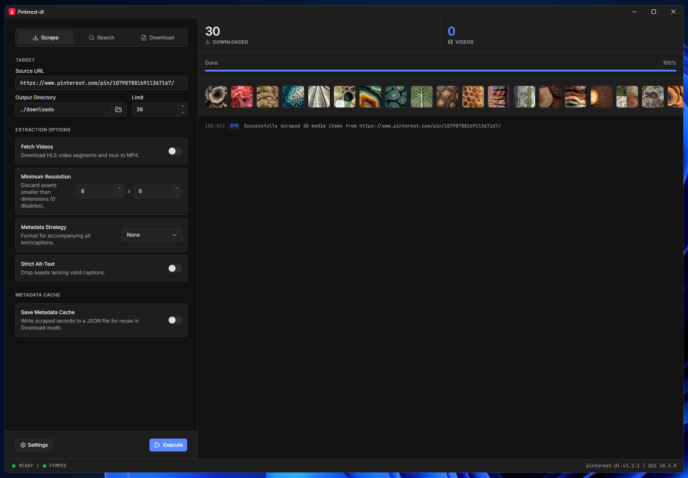

<div align="center">


# Pinterest Downloader GUI

A desktop GUI for scraping Pinterest media from a URL, built on top of the
[pinterest-dl](https://github.com/sean1832/pinterest-dl) API.

<a href="https://github.com/sean1832/pinterest-dl-gui/releases/latest"></a>

</div>

<div align="center">



</div>

> [!WARNING]
> This project is independent and not affiliated with Pinterest. It is designed
> solely for educational purposes. Automating the scraping of websites might
> conflict with their [Terms of Service](https://developers.pinterest.com/terms/).
> The repository owner disclaims any liability for misuse of this tool. Use it
> responsibly and at your own legal risk.

## Features

- **Three modes** - Scrape media from a pin/board URL, Search by keyword, or
  Download from a saved metadata cache.
- **Video support** - Fetch HLS video segments and mux them to MP4 via FFmpeg.
- **Resolution filtering** - Discard assets smaller than a minimum width/height.
- **Metadata export** - Save accompanying alt text/captions, with an optional
  strict mode that drops assets lacking valid captions.
- **Metadata cache** - Write scraped records to a JSON file for reuse in
  Download mode without re-scraping.
- **Native desktop window** - Runs as a standalone app (pywebview), no browser
  tab required.


## Download

Grab the latest precompiled Windows binary (built with
[Nuitka](https://nuitka.net/)) from the releases page. No Python installation
required:

**[Download the latest release](https://github.com/sean1832/pinterest-dl-gui/releases/latest)**

## Install from source

1. Clone the repository
   ```bash
   git clone https://github.com/sean1832/pinterest-dl-gui.git
   cd pinterest-dl-gui
   ```

2. Install dependencies
   ```bash
   pip install -r requirements.txt
   ```

3. Build the frontend and start the app
   ```bash
   python build.py && python app.py
   ```

## Build a release

Building an executable additionally requires Nuitka, declared in
`requirements-build.txt`:

```bash
pip install -r requirements-build.txt
python build.py --release --version 1.0.0
```

`--release` produces a standalone folder under `dist/app.dist/`. This is the
recommended build: it runs in place and starts fast.

From that standalone folder you can produce two distribution artifacts:

```bash
python build.py --zip --version 1.0.0        # dist/pinterest-dl-gui_1.0.0_x64.zip
python build.py --installer --version 1.0.0  # dist/pinterest-dl-gui_1.0.0_x64_setup.exe
```

- `--zip` packs the folder into a portable, grab-and-run archive.
- `--installer` wraps it in a Windows installer (Start Menu shortcut +
  uninstaller). This requires [Inno Setup](https://jrsoftware.org/isdl.php) 6 or
  7; the build invokes its `ISCC.exe` compiler with the script in `installer.iss`.

Both flags imply `--release` and can be combined (`--zip --installer`).

For a single portable exe instead, pass `--onefile`:

```bash
python build.py --onefile --version 1.0.0  # dist/pinterest-dl-gui_1.0.0_x64_portable.exe
```

The onefile build is one self-contained exe, but it unpacks to a temp directory
on every launch, so startup is slower than the standalone folder.

To produce every artifact at once, combine the flags:

```bash
python build.py --onefile --zip --installer --version 1.0.0
```

The onefile and standalone builds need separate Nuitka compiles (a onefile
build's `app.dist` holds a DLL payload, not a runnable exe), but the second
compile reuses Nuitka's C build cache, so it is much cheaper than a cold build.

## Tech stack

The app is a Python backend driving a Svelte frontend rendered in a native
desktop window - no browser, no local web server.

- **[pywebview](https://pywebview.flowrl.com/)** hosts the UI in the OS-native
  webview and bridges Python and JavaScript. 
- **[pinterest-dl](https://github.com/sean1832/pinterest-dl)** does the actual
  scraping and downloading; the GUI is a frontend over its API.
- **[Svelte 5](https://svelte.dev/) + [TypeScript](https://www.typescriptlang.org/)**
  with [Vite](https://vite.dev/) build the frontend, which `build.py` compiles
  to static files that pywebview loads from disk.
- **[Tailwind CSS](https://tailwindcss.com/) + [shadcn-svelte](https://shadcn-svelte.com/)**
  (bits-ui primitives, Lucide icons) provide the styling and components.
- **[Nuitka](https://nuitka.net/)** compiles everything into a standalone
  Windows binary for release.

## Support

<a href="https://www.buymeacoffee.com/zekezhang" target="_blank"></a>
</content>
</invoke>
